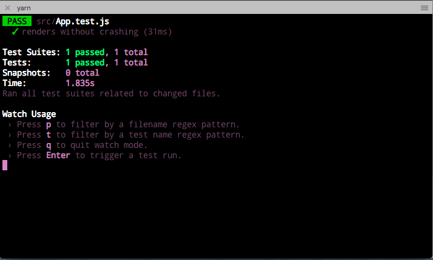
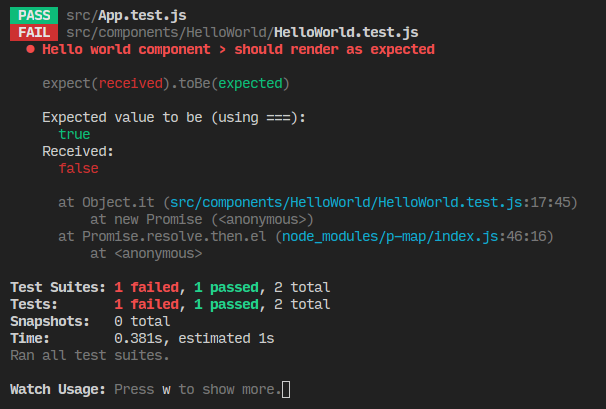

# Testing in React with Jest

## Learning Objectives (5 min / 0:05)
* Discuss the features of Jest and Enzyme
* Finish setting up a development environment with create-react-app
* Implement test driven development processes
* Use Jest and Enzyme to test React applications

* What is automated testing?
## Quick Review (5 min / 0:10)

<details><summary>Answer</summary>
When we write code to test our other code!</details>


* Why is it helpful?

<details><summary>Answer</summary>
when you create a larger application, the codebase will become bigger and more complex every time you add some features. At some point, adding code in file A will break features in file B, and to avoid these "side-effects" or at least recognize immediately when they happen, we need to write tests our app and run them on each change.</details>


* What tools did we use to test Express apps?

<details><summary>Answer</summary>
Mocha, Chai, SuperTest</details>


* What types of testing are there?

<details><summary>Answer</summary>
Smoke, functional, regression, performance, usability, security, compatibility, recovery, user acceptance, unit, integration, end-to-end, manual, automated
</details>


## What is Jest?
Jest is an easy to configure testing framework built by Facebook for testing JavaScript code. Jest runs your tests for you automatically when you have it in watch mode. It runs your tests in node instead of the browser so that they run faster. It also contains the API we will use to actually test our components.

## What is Enzyme?
Enzyme mimics JQuery's DOM manipulation library to make testing React easier. It allows us to grab the state of the component, simulate user actions, and grab elements from the virtual DOM.

## Configuration (10 min / 0:20)
Jest automatically looks for files with a `test.js` suffix, or for files in a `__tests__` folder. We will use the suffix today.

Let's start a React app for our testing purposes today.

If you have `create-react-app` installed globally with npm, run: 
```bash
$ create-react-app testing-lesson
```

Otherwise run 
```bash
$ npx create-react-app testing-lesson
```

We can run `$ yarn test` right now and see what happens.



We get some feedback from the app that our tests are all passing!

You can see in `App.test.js` that we only have one test right now: `renders without crashing`. We are going to be using Enzyme on top of Jest, so our tests will look different today.

Jest comes completely configured within `create-react-app`, so we don't have to do anything else to get it working. Let's now set up Enzyme.

```bash
$ yarn add enzyme enzyme-adapter-react-16 react-test-renderer
```

Create a file `setupTests.js`. Create-react-app reads this file to see if there is any additional setup for the tests. In that file, add the following:

```js
import { configure } from 'enzyme'
import Adapter from 'enzyme-adapter-react-16'

configure({ adapter: new Adapter() })
```

We should be good to write our first tests!

## What is Test Driven Development?
Test driven development is a development strategy where you write the tests first and then your code second. The tests should fail first, then you should write the minimum code necessary to make that test pass, then refactor to make the code cleaner. Then the cycle starts again with a new test! We will be using test driven development today. [Here](https://www.madetech.com/blog/9-benefits-of-test-driven-development) is an article about the benefits of test driven development.

## We Do: Hello World
Today, we will be building a couple of small projects in React. Let's create a components folder to store them.

`$ mkdir src/components`

Then, let's create a `HelloWorld` subdirectory within the components directory to create our first tests.

Let's create two files within it -- one called `HelloWorld.js` and one called `HelloWorld.test.js`. Right now, we want to build a component that just renders out a name that's fed to it via props. Let's write a test to see if our app is doing that!

```js
//HelloWorld.test.js

// Import React
import React from 'react'
import { shallow } from 'enzyme'

import HelloWorld from './HelloWorld'

// We will describe a block of tests
describe('Hello world component', () => {
	// we will write one individual test
  it('should render as expected', () => {
    // Shallow rendering renders a component without rendering any of its children
    const component = shallow(<HelloWorld name={'Your name'} />)
    // We create an assertion within the test that checks if our component renders our name prop
    expect(component.contains('Your name')).toBe(true)
  })
})

```
Right now, our test fails. When we run `yarn test` we get the following error:




Now, using test driven development principles, we will write the minimum code for it to pass. In this example, we just need a component that renders a name in it. Let's implement that:

```js
import React from 'react';

class HelloWorld extends React.Component {

	render() {
		return (
			<h1>{this.props.name}</h1>
		)
	}
}

export default HelloWorld;
```
Now our test passes!

## You Do: Writing Tests for a Counter App (30 min / 0:50)

For this exercise, you will be using test driven development to write the React code to pass some pre-written tests. 

We want to build a counter app. When we press a button, we want a number stored in state to increase, and when we press a second button that number will decrease. Given the following tests, write a React component that passes the following tests.

Let's create a folder and some files for our counter app.
```bash
$ mkdir src/components/Counter
$ touch src/components/Counter.{js,test.js}
```

Copy the following code into `Counter.test.js`:
```js
import React from 'react'
import { shallow } from 'enzyme'

import Counter from './Counter'

describe('Counter component', () => {

  let component
  beforeEach(() => {
    component = shallow(<Counter />)
  })
  
  // add the rest of the tests here

})
```
Now run `$ yarn test`. All previous tests should still be passing! No need to exit out of the tests, they will rerun automatically every time you save.

One by one, copy a test into the body of the testing block. Then, make that test succeed before copying in another one.

Take a look at the documentation for Jest and Enzyme as well. They will give you some context for the english verb-like function names.

* https://facebook.github.io/jest/docs/en/api.html
* https://github.com/airbnb/enzyme/tree/master/docs/api


1. 
```js
  it('should have a header that says "Counter"', () => {
    expect(component.contains(<h1>Counter</h1>)).toBe(true)
  })
```

2.
```js
  it('should have a state attribute called number initialized to zero', () => {
    expect(component.state('number')).toEqual(0)
  })
```

3.
```js
  it('should display the current number in an element with the className number', () => {
    expect(component.find('.number').text()).toEqual("0")
  })
```

4.
```js
  it('should have a button with a class plus that increases the number in state', () => {
    component.find('.plus').simulate('click')
    expect(component.state('number')).toEqual(1)
  })
```

5.
```js
  it('should have a button with a class minus that decreases the number in state', () => {
    component.find('.minus').simulate('click')
    expect(component.state('number')).toEqual(-1)
  })
```

[Solution](https://git.generalassemb.ly/ga-wdi-exercises/react-testing/blob/solution/src/components/Counter/Counter.js)

## Break (10 min / 1:00)

## We Do: To Do List App (60 min / 2:00)
Let's now create a To Do list app using test driven development. First let's create our files.

We will have two components -- a `ToDos.js` component which will hold individual `Todo.js` components.
```bash
$ mkdir src/components/ToDos
$ touch src/components/ToDos/ToDo{s.js,.js,s.test.js}
```

Now let's scaffold the configuration for our testing file.

`ToDos.test.js`
```js
import React from 'react'
import { mount } from 'enzyme'

import ToDos from './ToDos'
import ToDo from './ToDo'

describe('ToDos Component', () => {
  const listItems = [
    { task: 'create lesson', done: false },
    { task: 'clean apartment', done: false }
  ]

  let component
  // called before every test
  beforeEach(() => {
    // this time, mount instead of shallow because we will have subcomponents within our ToDos component
    component = mount(<ToDos tasks={listItems} />)
  })

  // add tests here

})
```
This looks pretty similar to our other testing blocks, but this time in `beforeEach()` we will use `mount` instead of `shallow` since we are going to have subcomponents within our parent component.  

Let's add our first test:
```js
  it('Should contain two todo subcomponents', () => {
    expect(component.find(ToDo).length).toBe(2)
  })
```

Let's write the minimum amount of code to make this test pass:

`ToDos.js`
```js
import React, { Component } from 'react'

import ToDo from './ToDo'

class ToDos extends Component {
  render () {
    return (
      <div>
        {this.props.tasks.map((task, idx) => 
          <ToDo task={task} key={idx} />
        )}
      </div>
    )
  }
}
```

`ToDo.js`
```js
import React from 'react'

const ToDo = ({ task }) => {
  return (
    <div>
      <div></div>
    </div>
  )
}
```
Now that we made that one pass, let's add another. 
```js
  it('Should render the todo list tasks', () => {
    component.find(ToDo).forEach((todo, idx) => {
      expect(todo.find('.task-name').text()).toBe(listItems[idx].task)
    })
  })
```

The code to pass this one is pretty minimal!
`ToDo.js`
```diff
import React from 'react'

const ToDo = ({ task }) => {
  return (
    <div>
+      <div className='task-name'>{task.task}</div>
    </div>
  )
}
```

Now let's create functionality for making a new list item.
```js
  it(`Should have have a state attribute for the new todo that should update 
      when the user types in an input`, () => {
    expect(component.state('newTodo')).toBe('')
    component.find('input').simulate('change', {target: {value: 'hello'}})
    expect(component.state('newTodo')).toBe('hello')
  })
```
Note that we can mock events by adding targets and values to the `simulate` method! We normally access `e.target.value`, so we create a similar structure when we mock the event!

`ToDos.js`
```diff
class ToDos extends Component {
  constructor (props) {
    super(props)

    this.state = {
+      newTodo: '',
    }
  }

+  handleChange = e => {
+    this.setState({
+      newTodo: e.target.value
+    })
+  }

  render () {
    return (
      <div>
+        <input onChange={this.handleChange}/>
...
```

### You Do: Finish To Do App (30 min / 2:30)

Write the following tests. After writing a test, implement the React code to pass that test.
* `Should create a new todo on the click of a button and update the UI with it`

* `Should mark todos as done on the click of a button`

* `Should have todos with the class checked if they are done and unchecked if they are not done`

Bonus: look at the completed application using `yarn start` and then style the application accordingly.

[Solution](https://git.generalassemb.ly/ga-wdi-exercises/react-testing/tree/solution/src/components/ToDos)

## Conclusion
* Why is test driven development helpful?
* What is Jest? How about Enzyme?
* What is the difference between `shallow` and `mount`?

### Resources
* [Solution Branch](https://git.generalassemb.ly/ga-wdi-exercises/react-testing/tree/solution/src)
* [Jest](http://facebook.github.io/jest/)
* [Enzyme](https://github.com/airbnb/enzyme/tree/master/docs/api)
